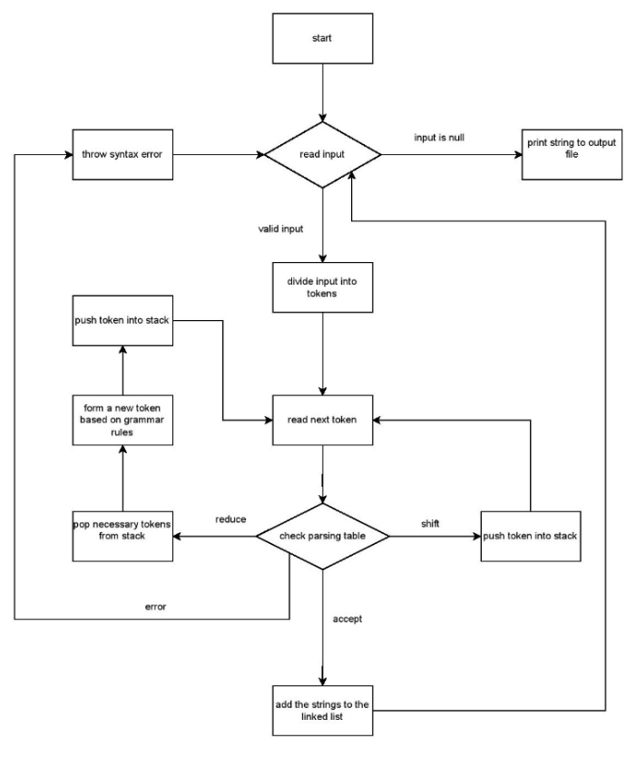
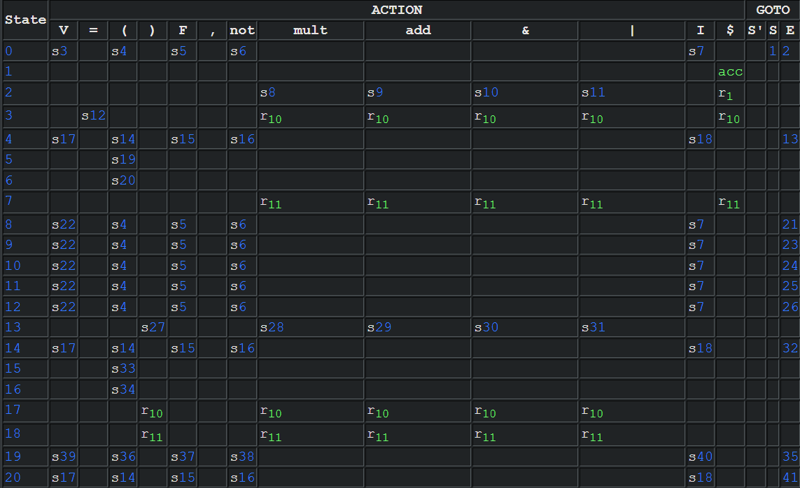

# Project 2: AdvCalc++


# CMPE 230: Systems Programming, Spring 2023

Yiğit Kağan Poyrazoğlu

Abdullah Umut Hamzaoğulları

1.05.2023


## 1	Introduction

In this project, similar to the earlier project, we implemented a translator for a calculator language (AdvCalc++) that converts the language into LLVM IR code. AdvCalc++ has the desired functionalities of the assignment using C language and its standard libraries. AdvCalc++ evaluates expressions and accepts variable assignments. 

The language implied by the notation is made sense of by explicitly writing out grammar rules, and parsing of any expression is achieved by implementing an LR(1) parser. Input strings are analyzed using regular expressions. Needed data structures like stacks are manually implemented.


## 2	Design and Architecture

The architecture of AdvCalc++ is similar to that of AdvCalc. AdvCalc++ makes use of a primitive parser to parse the input stream. The input as a line is taken from standard input and is divided into a string of tokens and evaluates these tokens from left to right. Then, the program generates the corresponding LLVM string for each expression and stores it in a linked list of strings. After evaluation, the strings are printed to the output file. 

The main structures used throughout the program are stacks, a linked list of strings and a parsing table (more information is provided below).

Hashmap was no longer needed to store the variables, a simple array was kept to track the assigned variables, and a linear search in them is done. Stacks are used in parsing the expression tokens. A more detailed functionality is illustrated below with a crude flowchart:





The parsing of tokens is done through a simple LR(1) parser. First, the input string is divided into tokens using regular expressions and then saved in-order as tokens. Then starting from the leftmost token, the tokens are processed in accordance with the states of a parsing table, either pushed to a token stack or reduced according to the rules of the grammar. (For a more detailed explanation, see below.) A correct expression is then expected to reach the end state, and a syntax error will hit an empty spot in the parsing table, thus halting the evaluation. 

The PEG (parsing expression grammar) of the language is as follows:

	

	


<table>
  <tr>
   <td><code>S' -> S</code>
<p>
<code>S -> E</code>
<p>
<code>S -> V = E</code>
<p>
<code>E -> ( E )</code>
<p>
<code>E -> F ( E , E )</code>
<p>
<code>E -> not ( E )</code>
<p>
<code>E -> E mult E</code>
<p>
<code>E -> E add E</code>
<p>
<code>E -> E & E</code>
<p>
<code>E -> E | E</code>
<p>
<code>E -> V</code>
<p>
<code>E -> I</code>
   </td>
  </tr>
  <tr>
   <td>
   </td>
  </tr>
</table>


where S’ is the starting string, 

S is the string non-terminal,

E is the expression non-terminal,

F is the non-unitary function terminal,

V is the variable terminal,

I is the integer terminal,

not is the not function terminal,

mult is the list of multiplicative terminals,

add is the list of additive terminals,

&, | are operator terminals,

(, ) and “,” are symbol terminals.

The theory behind the LR(1) parser is to see our language as a finite-state machine. In our case, that means, in our language, there are finitely next defined behaviors given what had come before, and there are finitely many situations of what may have come before. For example, if what we have is “3 + “, then only another expression or other tokens that will eventually reduce to an expression can come after.  

States contain information about the situation of what had come before, and languages are collections of states. For each state, we consider the next token and consider how we should interpret the next token. 

There are finite interpretations for a given state, and in this document, the different ways of considering the next token are sometimes referred to as “behaviors”. 

LR(1) parser has four behaviors:


1. Reduce according to rule r
2. Shift and go to state s
3. Go to state s
4. Accept

Reduce means to apply the relevant grammatical rule in reverse. For example, in our 5th rule, we define an expression E as F(E,E). Reducing would mean actually computing the result of this function and then labeling the result as just E. 

Shifting means reading one more token in our given token list. When we do that, we get to another state of our grammar, how we should consider the next token should be updated, so we also update our state. 

Go-to means just updating the state we are in.

Accepting is when we reach the end of the line token. It means to stop parsing and the reduced token is the output of our language.

In this system, when we “update our state”, we cannot simply change our current state, we should also store the previous ones because when we reduce an expression, we will get back to those previous states (from last to first). So they should be stored in a data structure like a stack. Similarly, while reducing, last-put tokens are taken out and new ones are put in, so they should also be stored in a data structure like a stack as well.

Our states and their associated defined behaviors form a table, called a parsing table. Below is our (part of) updated parsing table for this project:





Part of our parsing table representation. Illustration is done through https://jsmachines.sourceforge.net/machines/lr1.html

Sometimes, there may be conflicting behaviors given a state. This is simply called a conflict. For example, when our expression is “3+4*5” and we have read till “4”, the next token is *, and according to our grammar, we should continue reading to see the end of the operation. But at the same time, we have reached a state where two operands and the operator are read, so again according to our grammar, we should be reducing our expression “3+4”.

In this case, we introduce precedence and choose the behavior associated with the more precedent token, and therefore resolve the conflict. If conflicts existed even after the precedences, then that means we have an ambiguous grammar and should fix our grammar rules.

## 3	Implementation Details

Token types are stored in an enum and are determined accordingly with the grammar of the language:


```c
enum type{
    V,
    EQ,
    OBR,
    CBR,
    F,
    COMM,
    NOT,
    MULT,
    ADD,
    AND,
    OR,
    I,
    EOL, 
    Sp,
    S,
    E
};
```


Matching with grammar rules seen in Section 2:

EQ is “=”, OBR is “(“, CBR is “)”, COMM is “, ”, NOT is “not”, AND is “&”, OR is “|”, MULT is “*” or “/” or “%”, ADD is “+” or “-”, EOL is “$”, Sp is “S’ ”.

Tokens are stored in a struct. Their values and their types are stored as members of the struct:


```c
struct token{
    enum type type;
    char value[TOKEN_SIZE+1];
};

```


Due to limitations of the language and implementation convenience, two stacks were created to perform stack operations on different data types. The first one accepts tokens:


```c
struct Node{
    struct token *data;
    struct Node *next;
    int state;
};
```


```c
struct Stack{
    struct Node *top;
    int size;
};
```


While specified, state and size variables are never used in practice.

The other one accepts integers:


```c
struct intNode{
    int data;
    struct intNode *next;
};
```


```c
struct intStack{
    struct intNode *top;
    int size;
};
```


Stacks support simple push, pop, and peek operations. They are also initialized through init() functions. 

The stacks are used in parsing, one as a token stack and the other as a state stack. Stacks were implemented in a linked-list style because, in our implementation, there didn’t seem to exist a limitation on the number of stacks or the number of tokens that will go into the stacks. While implementations of a single stack are possible. two distinct stacks at the time were more convenient to implement.

Program memory, as stated above, was implemented using a hashmap. Since there is a rather small upper bound on the maximum number of variables, the hashmap is initialized to an array of fixed size. For any variable, the name string is hashed using quadratic rolling and stored accordingly. For any uninitialized space in the array, -1 is placed as a sentinel value (initialized at the beginning of the main function). 


```c
char *keys[TABLE_SIZE];
long long variables[TABLE_SIZE];

```


```c
int toHash(char* string){
    long hash = 0;
    int p = 991;
    int powr = 0;
    while (*string != '\0'){
        hash = hash + ((int) *string)*(power(p, powr));
        string++;
        powr++;
    }
    return hash%TABLE_SIZE;
}

```


The strings, as mentioned above, are stored as linked lists. This data structure is preferred as the main concern of the program is appending strings, which is achieved in O(1) time.

A string is initalized through the str struct:


```c
typedef struct linked_strings {
    int size;
    struct linked_strings* next;
    char text[];
} str;
```


Each string node stores its size, value and the next string it points to. This structure saves the developers from handling dynamic memory allocation for the  program string every time a new line is evaluated. 

### 3.1	Lexer

	The lexer acts on the string of the entire line. As stated above, regular expressions are used to divide the string into tokens, then token structs are initialized and stored.

	The regular expression used to match tokens is as follows:

	`[a-zA-Z]+|[0-9]+|[^[:alnum:]]`

	The expression is written in POSIX Extended Regular Expressions syntax. It matches words with uppercase or lowercase letters from the English alphabet, numbers, or non-alphanumeric characters of length 1.

	To compile and compare this regular expression, regex.h library is used.


```c
regexVal = regcomp(&regex, "[a-zA-Z0-9]+|[^[:alnum:]]", REG_EXTENDED);
```


regcomp() function compiles the regex string to an integer and stores it in a variable (named regex in this instance). Then, regexec() function is run to compare the input string with the regular expression:


```c
regexVal = regexec(&regex, msgbuf, 1, match, 0);
```


Here regex is the compiled expression, msgbuf is the input string, and match is the array to which buffers for the matching substring are recorded. Since global flag ( \g) is not supported by regex.h library, the function must be executed over and over until there are no more matches:


```c
regexVal = regexec(&regex, msgbuf + lastPtr, 1, match, 0);
```


Here lastPtr refers to the end index of the first match. Thus the function is executed on the substring to avoid matching the same expression repeatedly.

After matching an expression, a corresponding token is created. The token has two attributes: type and value. Type is the enum corresponding to the terminal/non-terminal attributed to the token, and value is the string matched by regular expression. 


```c
                  //check for beginning of the comment
            const char *comment = "%";
            int cmp = strcmp(tokenStr, comment);
            if (cmp == 0) break;
            //tokenize and add to array
            if (!isspace((int) tokenStr[0])) {
                struct token *token = tokenize(tokenStr, len);
                tokens[i] = *token;
                i++;
            }
```


```c
struct token *tokenize(char *string, int len){
    enum type type = getType(string, len);
    struct token *token = calloc(1, sizeof(struct token));
    token->type = type;
    strncpy(token->value, string, len+1);
    return token;
}
```


Since whitespace is not defined in the enum (or is not present in language grammar) it must be checked explicitly to avoid any token initialization errors. Also, since the comment character was not specified during the building of the grammar, it is explicitly checked. After such checks, the token is added to an array of tokens, preserving the line order. From this array, the tokens are passed to the parser.

### 3.2	Parser

As stated, LR(1) parser system is used to parse. A generator of the resulting finite state machine (and thus, the resulting table) from the grammar rules is used to get the parsing table, which shows how the next character should be interpreted.<sup><a href="https://jsmachines.sourceforge.net/machines/lr1.html">[1]</a></sup> There are 80 states and 17 behaviors defined to them. Then, the resulting table was converted to a 3-d array named parsingTable using a simple Python code. The structure of parsingTable is like this:

parsingTable is an array of states.

A state is an array of behaviors each associated with a token.

A behavior is a two-element int array determining what to do next, i.e. to reduce. The following table will show how to understand any behavior array:


<table>
  <tr>
   <td>First element
   </td>
   <td>Second element
   </td>
   <td>What it means
   </td>
  </tr>
  <tr>
   <td>-1
   </td>
   <td>-1
   </td>
   <td>accept
<p>
stop parsing and exit the program.
   </td>
  </tr>
  <tr>
   <td>0
   </td>
   <td>0
   </td>
   <td>The behavior is not defined - the language does not allow this input and cannot parse it.
   </td>
  </tr>
  <tr>
   <td>1
   </td>
   <td>s
   </td>
   <td>Shift and go to state s.
   </td>
  </tr>
  <tr>
   <td>2
   </td>
   <td>r
   </td>
   <td>Reduce the expressions according to r’th grammar rule
   </td>
  </tr>
  <tr>
   <td>3
   </td>
   <td>s
   </td>
   <td>Go to state s.
   </td>
  </tr>
</table>


As an example, the first element of the parsingTable, the state 0 is below:


```c
{{1, 3}, {0,0}, {1, 4}, {0,0}, {1, 5}, {0,0}, {1, 6}, {0,0}, {0,0}, {0,0}, {0,0}, {0,0}, {1, 7}, {0,0}, {0,0}, {3, 1}, {3, 2}}
```


In our LR(1) implementation, there are two stacks. One stack, named stateStack stores the states as integers, and the other, named tokenStack stores the tokens. 


```c
struct intStack *stateStack;
struct Stack *tokenStack;
```


In the main loop, after the input is lexed, if we haven’t reached the end of the line and if the input string was not empty, we consider the next token and the current state we are in and look at the table for our next move. 


```c
while (condition) {
       if ((step == 0) && (tokens[0].type == EOL)){
           break;
       }
       if (tokenIndex == TOKEN_SIZE-1) {
           //printf("Error!\n");
           break;
       }

       if(errorFoundUninitVar) break;


       struct token *nextToken;
       if (reduced) {
           nextToken = ((struct token *) peek(tokenStack));
       } else {
           nextToken = &tokens[tokenIndex];
       }

       int type = (*nextToken).type;
       int currentState = i_pop(stateStack);

       int action = parsingTable[currentState][type][0];
       int targetState = parsingTable[currentState][type][1];

       reduced = 0;
       step++;
       switch (action) {
           //accept the statement
           case -1: {
               if (isAssigned == 0) {
                   int strsize = snprintf(NULL, 0, "call i32 (i8*, ...) @printf(i8* getelementptr ([4 x i8], [4 x i8]* @print.str, i32 0, i32 0), i32 %s )\n", peek(tokenStack)->value) + 1;
                   str* resulting = (str*)malloc(sizeof(str)+sizeof(char)*(strsize+1));
                   sprintf(resulting->text,"call i32 (i8*, ...) @printf(i8* getelementptr ([4 x i8], [4 x i8]* @print.str, i32 0, i32 0), i32 %s )\n", peek(tokenStack)->value);
                   resulting->size = strsize;
                   resulting->next = NULL;
                   lastString->next = resulting;
                   lastString = resulting;
                   intermediateVariableIndex++;
               }
               condition = 0;
               break;
           }
           //error
           case 0:
               if (errorFoundUninitVar == 0) printf("Error on line %d!\n", line);
               hasError = 1;
               condition = 0;
               break;
           //shift
           case 1:
               i_push(stateStack, currentState);
               shift(targetState, nextToken);
               nextToken = NULL;
               tokenIndex++;
               break;
           //reduce
           case 2:
               reduce(targetState);
               reduced = 1;
               break;
           //goto
           case 3:
               i_push(stateStack, currentState);
               goTo(targetState);
               break;
           default:{
               printf("%s","Something has gone really, really wrong.");
               break;
           }
       }
   }
   free(stateStack);
   free(tokenStack);
   free(tokens);
   tokenIndex = 0;
   isAssigned = 0;
}
```


	

In our table, there are situations where we shouldn’t touch the token stack, but just push a new state to the stateStack, which is called a “go-to”	move. It is implemented in the goTo() function as


```c
void goTo(int state){
   i_push(stateStack, state);
}
```


shift() function just needs to take in one more token and go-to a state. It is implemented as


```c
void shift(int state, struct token *token){
   struct token *newtoken = token;
   push(tokenStack, newtoken);
   token = NULL;
   goTo(state);
}

```


reduce() function takes in the rule we should reduce our expression according to. Depending on the rule, it pops out the correct amount of tokens from the tokenStack. Then, it either changes the token type of a token or creates a new kind of token which is the reduced expression. (As discussed in Section 2, the rule is applied backward when reducing.) 

Here is an example of reducing according to the first three rules of our grammar:


```
void reduce(int rule){
   switch (rule){
       case 0:{
           struct token* token = (struct token*) pop(tokenStack);
           token->type = Sp;
           push(tokenStack, token);
           break;
       }
       case 1:{
           struct token* token = (struct token*) pop(tokenStack);
           token->type = S;
           push(tokenStack, token);
           break;
       }
       case 2:{
           struct token* expression = (struct token*) pop(tokenStack);
           pop(tokenStack);
           struct token* var = (struct token*) peek(tokenStack);
           put(var->value);
           var->type = S;
           isAssigned = 1;
           i_pop(stateStack);
           i_pop(stateStack);
           int strsize = 19 + (int)strlen(expression->value) + (int)strlen(var->value);
           str* resulting = (str*)malloc(sizeof(str)+sizeof(char)*(strsize+1));
           sprintf(resulting->text,"store i32 %s, i32* %%%s\n", expression->value, var->value);
           resulting->size = strsize;
           resulting->next = NULL;
           lastString->next = resulting;
           lastString = resulting;
           break;
       }
```


When the rule is about functions that take two inputs, we send the necessary information to another function called evaluate(). A similar case is with binary operations and the arithmetic() function.


```c
case 4:{
           pop(tokenStack);
           struct token* rightOperand = (struct token*) pop(tokenStack);
           pop(tokenStack);
           struct token* leftOperand = (struct token*) pop(tokenStack);
           pop(tokenStack);
           struct token* function = (struct token*) pop(tokenStack);
           char value[TOKEN_SIZE+1];
           sprintf(value, "%lld", evaluate(function, leftOperand, rightOperand));
           int len = strlen(value);
           struct token *newtoken = tokenize(value, len);
           newtoken->type = E;
           push(tokenStack, newtoken);
           i_pop(stateStack);
           i_pop(stateStack);
           i_pop(stateStack);
           i_pop(stateStack);
           i_pop(stateStack);
           break;
       }
```


evaluate and arithmetic functions do the necessary operations and add the needed string to our linked list of strings, called resulting, and added to be the next element of lastString. They have similar structures, and here is the evaluate function for the first two cases:


```c
char* evaluate(struct token* function, struct token* leftoperand, struct token* rightoperand){
   char* left = leftoperand->value;
   int strsize = 0;
   str* resulting = NULL;
   intermediateVariableIndex += 1;
   if (rightoperand == NULL){
       strsize = snprintf(NULL, 0, "%%%d = xor i32 %s,-1\n",intermediateVariableIndex, left) + 1;
       resulting = malloc(sizeof(str) + strsize + 1);
       snprintf(resulting->text, strsize + 1, "%%%d = xor i32 %s,-1\n",intermediateVariableIndex, left);
   }
   char* right = rightoperand->value;
   switch (getFunction(function->value)){
       case 0:
           break;
       case 1:
           strsize = snprintf(NULL, 0, "%%%d = xor i32 %s,%s\n",intermediateVariableIndex, left, right) + 1;
           resulting = malloc(sizeof(str) + sizeof(char)*strsize);
           snprintf(resulting->text, strsize + 1, "%%%d = xor i32 %s,%s\n",intermediateVariableIndex, left, right);
           break;
       case 2:
           strsize = snprintf(NULL, 0, "%%%d = shl i32 %s,%s\n",intermediateVariableIndex, left, right) + 1;
           resulting = malloc(sizeof(str) + sizeof(char)*strsize);
           snprintf(resulting->text, strsize + 1, "%%%d = shl i32 %s,%s\n",intermediateVariableIndex, left, right);
           break;

```


To make the full string of LLVM, we simply concatenate our linked lists with the help of functions defined in concatenator.c:


```c
//variableDeclarations is the LLVM code that contains all the variable declarations.
str* variableDeclarations = declareAll();
// firstString is the initial lines needed for the LLVM to work.
firstString.next = variableDeclarations;
while (variableDeclarations->next != NULL) variableDeclarations = variableDeclarations->next;
//middleString is the LLVM code that contains all the operations.
variableDeclarations->next = middleString;
//endString is the LLVM code that contains the final lines needed for the LLVM to work.
str* endString = (str*)malloc(sizeof(str)+sizeof(char)*12);
endString->size = 11;
endString->next = NULL;
strcpy(endString->text,"ret i32 0\n}");
lastString->next = endString;
if (hasError) return 0;
fprintf(fp, "%s",linkStrings(&firstString));
```


With the structures described above, tokens are parsed and when our code calls for a reduce, we write them in LLVM form to a string. Eventually, that means that we have compiled the code, and that is the moment our table points us to “accept”, and finish parsing. If the tokens contained undefined behaviors in our language or if an undefined variable is tried to be accessed, we declare whichever line containing this commands had errors in them, with the help of our global variable that counts our lines.

	

## 4	Testing and Validation


Since the grammar is almost completely specified, most syntax errors do

not even need separate handling. During testing, three cases were found to be uncovered by the specified grammar:

-empty line/whitespace line

-commenting

-whitespaces as tokens

Empty lines are checked before beginning the parsing process. The handling of the other two cases is discussed above.

While the program does not cover a broad possibility of faulty inputs (such as Unicode incompatibility), the assignment clarifies that the program will not be tested with such dirty inputs. For any input with which the program will be tested, it is expected to run without any problems. 

Similarly, the code has the same limitations of tokens and variables as the

assignment’s upper limit for those.

Testing is done as with the example inputs of the assignments and the possible edge cases that were posted in the course’s forum, and the outputs were identical to what they should be.

## 5	Usage and Examples


The usage is complicit with the assignment’s requirements. How it should be compiled is determined with a makefile,


```makefile
advcalc2ir: main.o concatenator.o lexer.o stacks.o
   gcc main.o concatenator.o lexer.o stacks.o -o advcalc2ir

main.o: main.c concatenator.h lexer.h stacks.h
   gcc -g -c main.c

lexer.o: lexer.c lexer.h
   gcc -g -c lexer.c

stacks.o: stacks.c stacks.h
   gcc -g -c stacks.c

concatenator.o: concatenator.c concatenator.h
   gcc -g -c concatenator.c
```


Below are some example inputs and their corresponding translations to LLVM:


```
8
8 * 2
ls(88              * 2 + 6, 2)
xor(9 - 3, 17 - 6)
not(10 * (23 - 0) * 0 - 1)
lr(10, 2 | 4)
rr(17, 1 & 3)
xor(ls(8, 12 + 3), not(3 - 10))
xor(xor(lr(10, 2), rr(17, 1)), 0)
not(xor(lr(10, 2), rr(17, 1)))
```


```llvm
; ModuleID = 'advcalc2ir'
declare i32 @printf(i8*, ...)
@print.str = constant [4 x i8] c"%d\0A\00"

define i32 @main() {
call i32 (i8*, ...) @printf(i8* getelementptr ([4 x i8], [4 x i8]* @print.str, i32 0, i32 0), i32 8 )
%2 = mul i32 8,2
call i32 (i8*, ...) @printf(i8* getelementptr ([4 x i8], [4 x i8]* @print.str, i32 0, i32 0), i32 %2 )
%4 = mul i32 88,2
%5 = add i32 %4,6
%6 = shl i32 %5,2
call i32 (i8*, ...) @printf(i8* getelementptr ([4 x i8], [4 x i8]* @print.str, i32 0, i32 0), i32 %6 )
%8 = sub i32 9,3
%9 = sub i32 17,6
%10 = xor i32 %8,%9
call i32 (i8*, ...) @printf(i8* getelementptr ([4 x i8], [4 x i8]* @print.str, i32 0, i32 0), i32 %10 )
%12 = sub i32 23,0
%13 = mul i32 10,%12
%14 = mul i32 %13,0
%15 = sub i32 %14,1
%16 = xor i32 %15,-1
call i32 (i8*, ...) @printf(i8* getelementptr ([4 x i8], [4 x i8]* @print.str, i32 0, i32 0), i32 %16 )
%18 = or i32 2,4
%19 = shl i32 10,%18
%20 = sub i32 32,%18
%21 = lshr i32 10,%20
%22 = or i32 %19,%21
call i32 (i8*, ...) @printf(i8* getelementptr ([4 x i8], [4 x i8]* @print.str, i32 0, i32 0), i32 %22 )
%24 = and i32 1,3
%25 = lshr i32 17,%24
%26 = sub i32 32,%24
%27 = shl i32 17,%26
%28 = or i32 %25,%27
call i32 (i8*, ...) @printf(i8* getelementptr ([4 x i8], [4 x i8]* @print.str, i32 0, i32 0), i32 %28 )
%30 = add i32 12,3
%31 = shl i32 8,%30
%32 = sub i32 3,10
%33 = xor i32 %32,-1
%34 = xor i32 %31,%33
call i32 (i8*, ...) @printf(i8* getelementptr ([4 x i8], [4 x i8]* @print.str, i32 0, i32 0), i32 %34 )
%36 = shl i32 10,2
%37 = sub i32 32,2
%38 = lshr i32 10,%37
%39 = or i32 %36,%38
%40 = lshr i32 17,1
%41 = sub i32 32,1
%42 = shl i32 17,%41
%43 = or i32 %40,%42
%44 = xor i32 %39,%43
%45 = xor i32 %44,0
call i32 (i8*, ...) @printf(i8* getelementptr ([4 x i8], [4 x i8]* @print.str, i32 0, i32 0), i32 %45 )
%47 = shl i32 10,2
%48 = sub i32 32,2
%49 = lshr i32 10,%48
%50 = or i32 %47,%49
%51 = lshr i32 17,1
%52 = sub i32 32,1
%53 = shl i32 17,%52
%54 = or i32 %51,%53
%55 = xor i32 %50,%54
%56 = xor i32 %55,-1
call i32 (i8*, ...) @printf(i8* getelementptr ([4 x i8], [4 x i8]* @print.str, i32 0, i32 0), i32 %56 )
ret i32 0
}
```


## 6	Conclusion

The second project of the Systems Programming course, AdvCalc++, is a translator based on a compact grammar. By first specifying the grammar, then generating the parsing table and constructing the lexer and parser algorithms, it is implemented in a holistic, theory-compliant manner to provide insight into compiler/interpreter design and language parsing.

Interestingly, the project was not very difficult at its design concept, and neither in most of its implementation; except for the fact that we had not learnt about buffer overflows beforehand and had used functions like sprintf with static memory allocation. So the main obstacle was to figure out a way to handle dynamic string sizes.

Also it should be noted that the program has some memory leaks but none of us had any time or energy to solve them. Also they are unimportant since an average computer is way too powerful to crash on ~50 KB of leaked memory.

The main takeaway of this project was, undeniably, that it has taught us how to use valgrind and why one should never use unsafe string methods.
